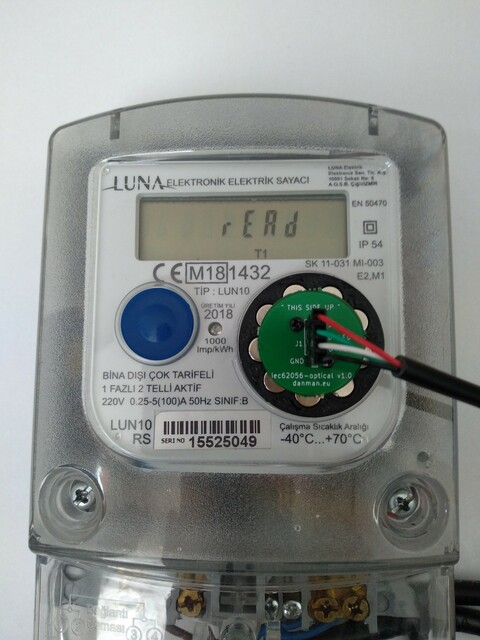

# iec62056-optical

Adapter for reading meters with IEC62056 optical interface.

View this project [online](https://kicanvas.org/?github=https%3A%2F%2Fgithub.com%2Fdanielkucera%2Fiec62056-optical%2Ftree%2Fmaster)

You can buy complete adapter in [my shop](https://lectronz.com/products/iec-62056-optical-interface)

# Photos

